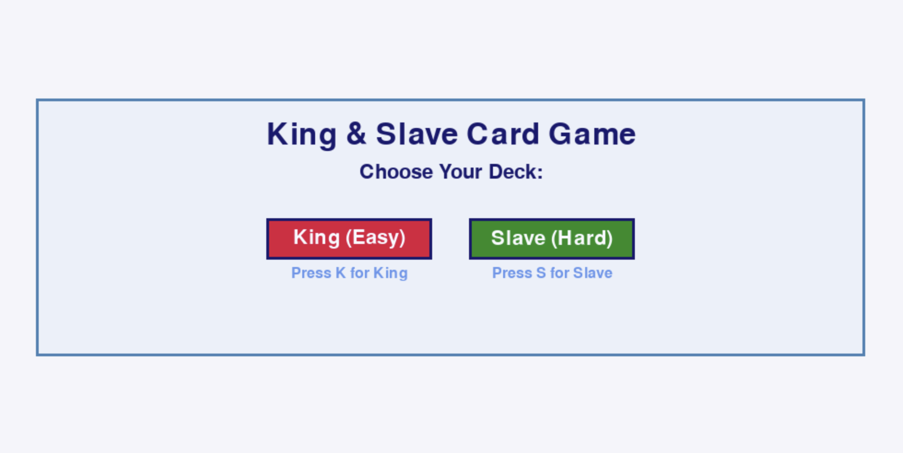
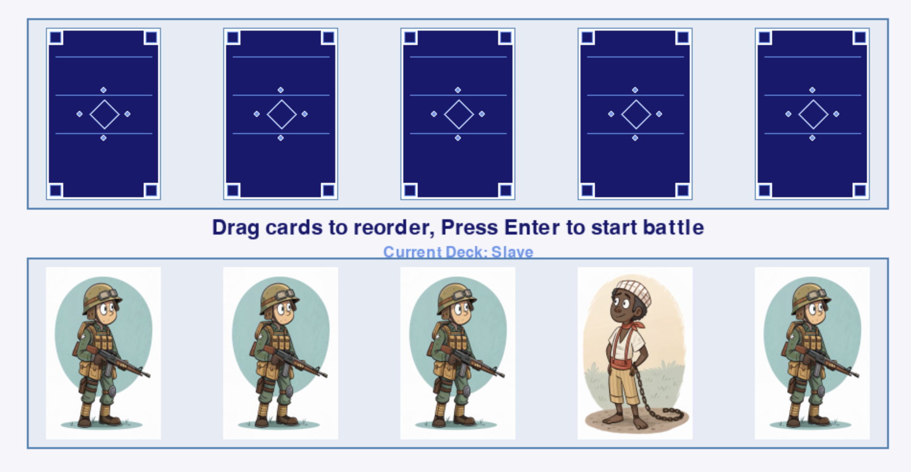
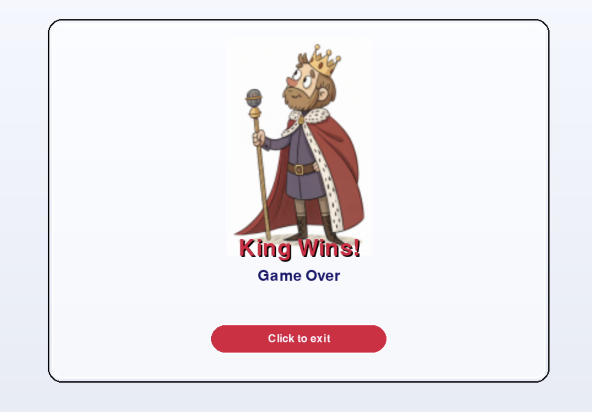
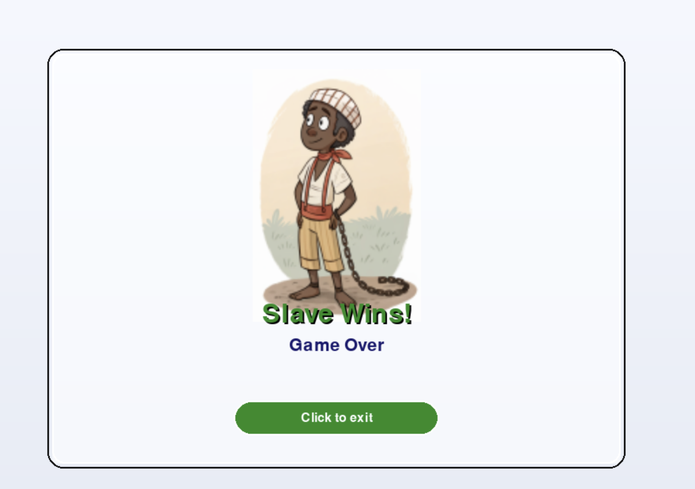

# King & Slave Card Game

A strategic turn-based card game built with Pygame, where players choose between the King or Slave deck and battle against a computer opponent. The game features drag-and-drop card arrangement, animated battles, a unique cyclical win condition, and an enhanced video loading animation system.

---

## 🎮 Game Overview

In **King & Slave**, players select one of two asymmetric decks:

- **King Deck**: 1 King + 4 Soldiers
- **Slave Deck**: 1 Slave + 4 Soldiers

The computer receives the opposite deck. Each round, both sides reveal one card simultaneously. The game continues until a win condition is met or all cards are played.

### 🆕 New Features
- **Video Loading Animation**: Enhanced startup experience with high-quality MP4 loading animation
- **Improved Visual Quality**: Video rendering matches cover image quality for seamless experience
- **Automatic Fallback**: Graceful handling when video files are missing

---

## 🚀 Quick Start

### 1. Install Dependencies

**Option A: Automatic installation (recommended)**
```bash
python3 install_dependencies.py
```

**Option B: Manual installation**
```bash
pip install -r requirement.txt
```

**Option C: Using virtual environment (best practice)**
```bash
# Create virtual environment
python3 -m venv .venv

# Activate virtual environment
# On macOS/Linux:
source .venv/bin/activate
# On Windows:
.venv\Scripts\activate

# Install dependencies
pip install -r requirement.txt
```

### 2. Run the Game
```bash
python3 "King&Slave Game.py"
```

### 3. Enjoy the Experience
- Watch the loading animation on startup
- Choose your deck (King or Slave)
- Drag and arrange cards strategically
- Battle against the computer opponent

---

## 📋 System Requirements

- **Python**: 3.7+
- **Operating System**: Windows, macOS, Linux
- **Memory**: 4GB+ recommended
- **Graphics**: OpenGL 2.0+ support

### ✅ Cross-Platform Compatibility

This game is **fully compatible** with both Windows and macOS:
- Uses `os.path.join()` for cross-platform path handling
- No platform-specific system calls
- Tested on macOS and Windows environments

---

## 📦 Core Dependencies

- `pygame>=2.1.0` - Game engine
- `opencv-python>=4.5.0` - Video playback support
- `numpy>=1.21.0` - Numerical computing support

---

## 🧠 Game Mechanics

### 🔹 Deck Construction

- Both player and computer decks contain 5 cards:
  - 1 main card (King or Slave)
  - 4 Soldiers
- Cards are arranged horizontally on screen.
- Computer deck is shuffled randomly.
- Player can drag and reorder cards before each round.

### 🔹 Card Arrangement

- During the **arrange phase**, players can:
  - Drag cards using the mouse
  - Reorder them freely
  - Press `Enter` to initiate battle

### 🔹 Battle Phase

- One card from each side is revealed per round.
- Animated flip effect displays both cards.
- Outcome is determined by the **cyclical win rule**.

### 🔹 Win Rule (Cyclical)

- If both cards are the same → Draw
- Otherwise:
  - King beats Soldier
  - Soldier beats Slave
  - Slave beats King

### 🔹 Victory Conditions

- First side to win a round is declared the winner.
- If all 5 rounds are played without a winner → Game ends in a **Draw**

### 🔹 Round Progression

- After each round:
  - Used cards are removed
  - Remaining cards are repositioned
  - Player re-enters **arrange phase** to reorder remaining cards
  - Game continues until a win or draw

---

## 🖱 Controls

| Action                  | Key / Mouse |
|-------------------------|-------------|
| Select King Deck        | `K`         |
| Select Slave Deck       | `S`         |
| Drag card               | Mouse click & move |
| Drop card               | Mouse release |
| Confirm arrangement     | `Enter`     |
| Quit game               | `Esc` or close window |

---

## 🔊 Audio Feedback

- Card flip sound on battle start
- Victory / Defeat / Draw sound effects
- Background music (optional)

---

## 🎬 Video Loading Animation

The game now features a high-quality video loading animation that plays on startup:

### Features
- ✅ **Auto-scaling**: Automatically adapts to window size
- ✅ **Aspect Ratio Preservation**: Maintains video proportions
- ✅ **High-Quality Rendering**: Uses same scaling algorithm as cover images
- ✅ **Seamless Integration**: Matches cover image quality
- ✅ **Automatic Playback**: Plays and transitions automatically
- ✅ **Graceful Fallback**: Falls back to cover image if video is missing

### Technical Details
- Video file: `assets/King&Slave_loadinganimation.mp4`
- Format: MP4 with 24 FPS, 640x362 resolution
- Duration: ~5 seconds
- Scaling: Uses pygame.transform.smoothscale for optimal quality

---

# 🎮 King & Slave Game Demo

This is a prototype for a card-based battle game. Players can drag cards to reorder and initiate battles between characters from opposing factions.

---

## 🔄 Animated Demo


---

## 🖼️ Key Gameplay Screenshots

### 🏁 Faction Selection  
Players choose their allegiance before the battle begins.



---

### 🔢 Card Order Selection  
Players drag and reorder cards to determine battle sequence.



---

### 👑 King Victory Scene  
The King wins the battle—celebration and outcome displayed.



---

### 🧎 Slave Victory Scene  
The Slave triumphs—alternate ending and visuals shown.



---

## 📁 Project Structure

```
KingandSlave_CardGame/
├── King&Slave Game.py              # Main game file
├── requirement.txt                 # Project dependencies
├── install_dependencies.py         # Auto-installation script
├── README.md                       # Project documentation
├── .gitignore                      # Git ignore rules
└── assets/                         # Game assets directory
    ├── King&Slave_loadinganimation.mp4  # Loading animation video
    ├── King&Slave_GameCoverImage.png    # Game cover image
    ├── King&Slave_GameDemo.gif          # Game demo animation
    ├── King&Slave_BGM.mp3              # Background music
    ├── King&Slave_Screenshot_1.png     # Gameplay screenshot 1
    ├── King&Slave_Screenshot_2.png     # Gameplay screenshot 2
    ├── King&Slave_Screenshot_3.png     # Gameplay screenshot 3
    ├── King&Slave_Screenshot_4.png     # Gameplay screenshot 4
    ├── King&Slave_RoleCard_King.png    # King role card
    ├── King&Slave_RoleCard_Slave.png   # Slave role card
    └── King&Slave_RoleCard_Soldier.png # Soldier role card
```

---

## 🔧 Development Information

### Version History
- **v1.0**: Basic card game functionality
- **v1.1**: Video display optimization, rotation fix
- **v1.2**: Video quality optimization, reduced over-processing
- **v1.3**: Video clarity optimization, matching cover image quality
- **v1.4**: Project cleanup, improved .gitignore, cross-platform compatibility verified

### Technical Features
- Pygame-based game rendering
- OpenCV integration for video processing
- High-quality video scaling algorithms
- Smooth animations and visual effects
- Drag-and-drop interface
- Audio feedback system
- Cross-platform file path handling (Windows/macOS/Linux compatible)

---

## 🐛 Troubleshooting

### Common Issues

**Q: Video loading fails?**
A: Ensure `assets/King&Slave_loadinganimation.mp4` exists. The game will automatically fall back to the cover image.

**Q: Dependency installation fails?**
A: Try using `pip install --user -r requirement.txt` or run the auto-installation script.

**Q: Game runs slowly?**
A: Ensure your system meets minimum requirements and close other resource-intensive programs.

**Q: Video appears rotated or distorted?**
A: The latest version fixes video orientation issues. Make sure you're using the latest code.

---

## 📄 License

This project is for educational and demonstration purposes only.

---

## 🤝 Contributing

Issues and Pull Requests are welcome to improve the game!

---

**Enjoy the game!** 🎮✨